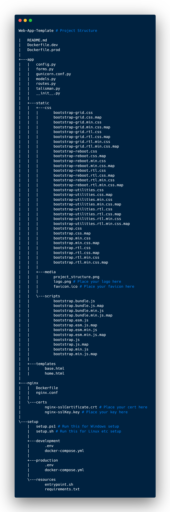

# Web App Template

Created with ❤️ by [Zesty Lemur](https://github.com/zesty-lemur/) - [Licensed](https://github.com/zesty-lemur/Web-App-Template/blob/main/LICENSE) under GNU GPLv3.

## What is this?

This is template repository for a containerised Flask application complete with persistent PostgreSQL database, Nginx reverse-proxy, and Redis in-memory database for rate-limiting. As an added bonus, it even includes Bootstrap5, ready to go!

You can clone the repo, generate your self-signed SSL certificates, and deploy the app using the setup-script in mere minutes!

## How do I use it?

1. Clone the repo:

    ```shell
    git clone https://github.com/zesty-lemur/Web-App-Template.git <your-project-name>
    cd <your-project-name>
    ```

2. From the root (`<project-name>`), either:

    a. create a self-signed certificate using openssl (this can be done via WSL if on Windows)

    ```bash
    openssl req -x509 -nodes -days 365 -newkey rsa:2048 -keyout nginx/certs/selfsigned.key -out nginx/certs/selfsigned.crt -subj '/CN=0.0.0.0'
    ```

    or

    b. copy your SSL certificate and key to [nginx/certs](./nginx/certs).

3. Run the appropriate setup script (from [setup_scripts](./setup_scripts/)):

    a. For Linux etc:

    ```bash
    chmod +x scripts/setup.sh
    ./scripts/setup.sh
    ```

    b. For Windows:

    ```powershell
    .\scripts\setup.ps1
    ```

## How is the project structured?

Thanks to the magic of `tree` and [Carbon](https://carbon.now.sh/), you can view the project structure as a lovely bit of art:



## Can I contribute?

Please do! You can [join the discussion](https://github.com/zesty-lemur/Web-App-Template/discussions), create an [Issue](https://github.com/zesty-lemur/Web-App-Template/issues) or [Pull Request](https://github.com/zesty-lemur/Web-App-Template/pulls)*, or just share the repo!

<super><small>* bonus points for the funniest commit messages!</small></super>
